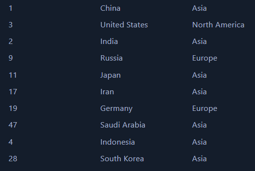

# 🌍 Global CO2 Emissions Dashboard
## 🚀 Introduction

Climate change is an undeniable global challenge, and addressing it starts with understanding the data. This project is a culmination of my passion for environmental sustainability and my skills in data analysis.

The CO2 Emissions Analysis Dashboard offers insights into global CO2 emissions, enabling users to explore trends, identify key contributors, and analyze actionable data. From cleaning raw datasets to visualizing compelling insights, this journey showcases how data analytics can empower sustainable decision-making.

This project is a testament to my commitment to sustainability and leveraging data to make a meaningful impact.

The dataset used in this project is sourced from Kaggle[ Co2 Data
](https://github.com/owid/co2-data?tab=readme-ov-file) which provides a foundation for my analysis, containing detailed information on CO2 emissions (annual, per capita, cumulative and consumption-based), other greenhouse gases, energy mix, and other relevant metrics. In this project, I focus on co2 emissions majorly.

# 🎯 Project Objectives
1. Highlight Global Emission Trends: Analyze emissions across years, regions, and sectors to identify patterns.
2. Sectoral Contribution: Break down emissions by coal, oil, gas, and other sources to focus on actionable targets.
3. Per Capita Insights: Ensure fair comparisons by incorporating population data into the analysis.
4. Dynamic Interaction: Enable users to filter, explore, and derive insights through an intuitive dashboard.
5. Advocacy for Change: Use data to create awareness and inspire sustainable actions.

# Tools I Used

For my deep dive into the Co2 Data , I harnessed the power of several key tools:

- **Excel:** For understanding the data, removing the columns I do not need for my analysis and initial cleaning up the dataset 
- **Python:** Used **Pandas** for further cleaning and transforming the data. Looked into missing values and removed further columns and rows that have missing co2 data required for analysis. 
- **Postresql:** The backbone of my analysis, allowing me to analyze the data and find critical insights. I performed calculations, aggregating and used window functions for my analysis.
- **Power BI:**  For visualizing the data and bringing the analysis to life. I used DAX for further calculations and made visuals using bar, line, map etc
- **Visual Studio Code:** My go-to for executing my Python scripts.
- **Git & GitHub:** Essential for version control and sharing my Python & SQL code and analysis, ensuring collaboration and project tracking.

# Data Cleaning & Prep

This section outlines the steps taken to prepare the data for analysis, ensuring accuracy and usability. I have used **Excel** for the initial cleaning and removing of unnecessary columns and then  **Python** for the further cleaning and transformations.The notebook with detailed steps here: [Data Cleaning](Data_cleaning.ipynb)

## Excel

Using Excel I identified the columns that I may not require in my analysis and removed them. I looked into the columns or rows having missing crictical data and then removed them. I checked for any inconsistencies in the data in the first outlook. The revised dataset can be found here : [Cleaned Dataset](dataset\Emission_data_cleaned.xlsx)

## Python - Advanced cleaning 

I stated by importing the cleaned dataset and checking the data using info, describe() etc to understand the data and the datatypes. I further looked into the missing and duplicated values and took care of it. 

I wanted to add a column for continent for the countries as part of my analysis. For that i used the **pycountry** and **pycountry_convert** libraries to map the countries in my data to the continents(Antartica is not included due to no data/lack of data), which is understandable since they doesmt seem to have that much of co2 emissions.

```python
# Function to map country to continent
def map_country_to_continent(country_name):
    try:
        country_alpha2 = country_name_to_country_alpha2(country_name)
        continent_code = country_alpha2_to_continent_code(country_alpha2)
        continent_mapping = {
            'AF': 'Africa',
            'AS': 'Asia',
            'EU': 'Europe',
            'NA': 'North America',
            'SA': 'South America',
            'OC': 'Oceania',
            'AN': 'Antarctica'
        }
        return continent_mapping.get(continent_code, None)
    except KeyError:
        return None

# Map countries to continents
data_cleaned['continent'] = data_cleaned['country'].apply(map_country_to_continent)

```
After mapping the countries and getting a new column for continent, I further looked into any mapping issues that may have occured and fixed those. I also removed several non country rows in the country columns (low income contries, high income countries, OECD , non OECD etc). 

After this data preparation , I got the final cleaned dataset ready for my SQL analysis. The full python code for the data cleaning and preparation can be found here : [Data Preparation](Data_cleaning.ipynb) and the final dataset here : [Final Cleaned Dataset](dataset\cleaned_data.csv) 

# SQL Analysis 

Now , the cleaned dataset i analysed further using SQL . In my project, I have used **PostgreSQL** in Visual code environment. I created the table using python **sqlalchemy** library . Then imported the data to the sql database through PgAdmin directly. 

After importing the data, I went on to do the analysis . some of them i have stated below and the entire sql can be found here : [Co2 EmisssionS Analysis]()

1. Total Co2 Analysis per year to see how it changes over time


2.  Top 10 countries having the maximum emissions 

Here I wanted to see the top co2 emitting countries while also looking how population is also a major factor contributing to pollution. Below are the results of the query.




3. Co2 per capita Analysis

```sql
-- Query: CO2 Emissions per Capita by Country in 2023 with Ranking
SELECT 
    country, 
    continent,
    SUM(co2) / SUM(population)  AS CO2_per_Capita,
    RANK() OVER (ORDER BY SUM(co2) / SUM(population) DESC) AS CO2_per_Capita_Rank
FROM emissions_data
WHERE year = 2023
GROUP BY continent,country 
ORDER BY CO2_per_Capita_Rank;
```

Here I wanted to see what was the co2 per capita to compare emissions across countries with various population sizes. I could see that smaller , wealthier countries such as Qatar , Bahrain, UAE, Saudi Arabia etc have the highest per capita emissions while densely populated countries have low per capita values despite higher emissions. 

4. 